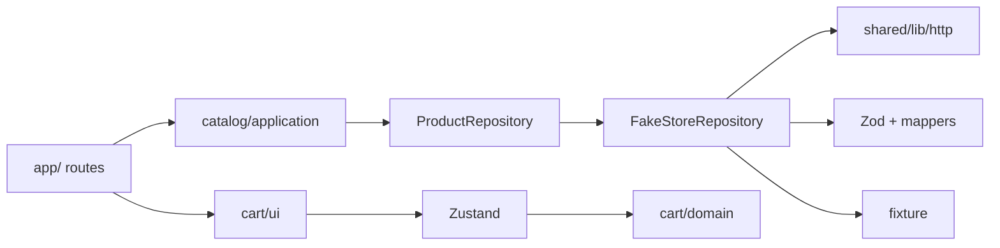
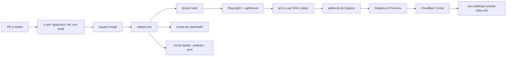

# Norte — Tienda de demostración

Aplicación de comercio electrónico desarrollada como solución al **Reto Técnico 2026 de Delosi**. Consume el catálogo público de [FakeStore API](https://fakestoreapi.com) y ofrece home, listado con filtros en la URL, fichas de producto con SEO, carrito persistente en el navegador y un pipeline de despliegue self-hosted.

| Entorno                          | URL                                                                                                                 |
| -------------------------------- | ------------------------------------------------------------------------------------------------------------------- |
| Producción                       | [csti-challenge.orlando-rojas.com](https://csti-challenge.orlando-rojas.com)                                        |
| Storybook                        | [csti-challenge-storybook.orlando-rojas.com](https://csti-challenge-storybook.orlando-rojas.com)                    |
| Catálogo de respaldo (FakeStore) | [csti-challenge-fakestore.orlando-rojas.com](https://csti-challenge-fakestore.orlando-rojas.com)                    |
| Espejo en Vercel                 | Lo publica `release.yml` con `vercel deploy --prebuilt --prod`. No es indexable y su canonical apunta a producción. |

La interfaz está en español. El código, los comentarios y los mensajes de commit están en inglés.

## Tabla de contenidos

1. [Funcionalidades](#funcionalidades)
2. [Stack tecnológico](#stack-tecnológico)
3. [Arquitectura](#arquitectura)
4. [Datos, caché y resiliencia](#datos-caché-y-resiliencia)
5. [SEO](#seo)
6. [Rendimiento](#rendimiento)
7. [Requisitos previos](#requisitos-previos)
8. [Ejecución en entorno local](#ejecución-en-entorno-local)
9. [Variables de entorno](#variables-de-entorno)
10. [Scripts disponibles](#scripts-disponibles)
11. [Pruebas y calidad](#pruebas-y-calidad)
12. [Ejecución con Docker](#ejecución-con-docker)
13. [API interna](#api-interna)
14. [Integración y despliegue continuo](#integración-y-despliegue-continuo)
15. [Rollback](#rollback)
16. [Lineamientos de contribución](#lineamientos-de-contribución)
17. [Decisiones técnicas y trade-offs](#decisiones-técnicas-y-trade-offs)
18. [Trabajo futuro](#trabajo-futuro)
19. [Solución de problemas](#solución-de-problemas)

## Funcionalidades

- **Home** (`/`): hero con el producto mejor valorado, accesos por categoría y una selección de destacados por rating.
- **Listado (PLP)** (`/products`): categorías como enlaces reales, búsqueda con debounce y `useTransition`, ordenamiento y paginación de 12 productos. El estado vive en la URL.
- **Ficha (PDP)** (`/products/[id]`): metadata dinámica, JSON-LD, imagen Open Graph y productos relacionados de la misma categoría, cargados en streaming.
- **Vista rápida**: el icono de vista previa abre `/products/[id]/preview` en un modal (ruta interceptada). El resto de la tarjeta abre la ficha completa. Una navegación de documento a la vista previa responde `308` hacia la ficha, así que recargar o compartir el enlace muestra la PDP.
- **Carrito** en `localStorage` (`norte-cart`), sincronizado entre pestañas y presentado en un drawer con cantidades, subtotal y eliminación. El badge espera a la rehidratación para no desalinear el HTML.
- **Modo oscuro** con `next-themes`, sin parpadeo, y **View Transitions** compartidas entre la imagen y el título de la tarjeta y los de la ficha.
- **Accesibilidad**: skip link, foco visible, teclado (Radix), `aria-live` en el carrito y en el conteo del listado, `aria-current` en categoría y página, y `prefers-reduced-motion`.
- **SEO técnico**: `sitemap.xml`, `robots.txt`, canonical y `noindex` en búsquedas y en el espejo.
- **Observabilidad**: logs JSON con Pino, trazas y métricas OpenTelemetry, y Web Vitals reales vía `/api/vitals`.

Parámetros del listado (nuqs). Los valores por defecto no se escriben en la URL:

| Parámetro  | Por defecto | Valores                                                                              |
| ---------- | ----------- | ------------------------------------------------------------------------------------ |
| `q`        | vacío       | Texto libre. La búsqueda ignora tildes y recorre título, descripción y categoría.    |
| `category` | vacío       | Slug de FakeStore (`electronics`, `jewelery`, `men's clothing`, `women's clothing`). |
| `sort`     | `rating`    | `rating`, `price-asc`, `price-desc`, `name`.                                         |
| `page`     | `1`         | Entero ≥ 1. Cada página tiene 12 productos.                                          |

## Stack tecnológico

| Área                | Tecnología                                                                      |
| ------------------- | ------------------------------------------------------------------------------- |
| Framework           | Next.js 16 (App Router, Cache Components), React 19, React Compiler             |
| Lenguaje            | TypeScript (`strict`, `noUncheckedIndexedAccess`, `exactOptionalPropertyTypes`) |
| Estilos y UI        | Tailwind CSS 4, Radix UI, shadcn/ui, lucide-react, `next-themes`                |
| Estado              | Zustand (carrito), nuqs (estado en la URL)                                      |
| Validación          | Zod 4, `@t3-oss/env-nextjs`                                                     |
| Observabilidad      | Pino, OpenTelemetry (`@vercel/otel` y exportador OTLP)                          |
| Pruebas             | Vitest, Testing Library, MSW, Playwright, axe-core, Lighthouse CI               |
| Documentación de UI | Storybook 10 (`@storybook/nextjs-vite`)                                         |
| Calidad de código   | ESLint (`eslint-plugin-boundaries`), Prettier, Husky, lint-staged, commitlint   |
| Infraestructura     | Docker, GitHub Actions, GHCR, Dokploy, Cloudflare, Vercel                       |

## Arquitectura

El proyecto sigue una arquitectura modular por dominio. Cada módulo separa dominio, aplicación, infraestructura y UI, y expone una sola API pública.

```text
src/
├── app/                       Rutas, layouts, SEO y endpoints
│   ├── page.tsx               Home
│   ├── sitemap.ts  robots.ts  opengraph-image.tsx
│   ├── api/                   health, vitals, revalidate
│   ├── products/
│   │   ├── (listing)/         PLP
│   │   └── [id]/              PDP, not-found, opengraph-image
│   │       └── preview/       Vista previa como documento
│   └── @modal/(.)products/[id]/preview/   Vista rápida interceptada
├── modules/
│   ├── catalog/               domain · application · infrastructure · ui
│   └── cart/                  domain · store · ui
├── shared/                    HTTP, logger, SEO, entorno, layout común
├── instrumentation.ts         OpenTelemetry
└── proxy.ts                   404 de ids inválidos y redirect de la vista previa
```

Reglas de dependencia, verificadas por `eslint-plugin-boundaries`:

- `src/app` solo importa la API pública de cada módulo (`src/modules/*/index.ts`).
- La capa de dominio no depende de infraestructura ni de UI.
- La UI no importa infraestructura.
- Un módulo no accede a los internos de otro.



Cómo se aplica SOLID:

- **Inversión de dependencias.** La aplicación depende de la interfaz `ProductRepository`. El cliente HTTP y FakeStore quedan detrás.
- **Responsabilidad única.** El esquema, el mapper, el cliente y el repositorio están separados.
- **Abierto/cerrado.** El orden es un `Record<SortKey, Comparator>`. Una clave nueva no reescribe el filtro.

Las decisiones están en [`docs/adr`](docs/adr):

| ADR                                                    | Tema                                       |
| ------------------------------------------------------ | ------------------------------------------ |
| [0001](docs/adr/0001-cache-components.md)              | Cache Components                           |
| [0002](docs/adr/0002-cart-state.md)                    | Estado del carrito                         |
| [0003](docs/adr/0003-url-state-nuqs.md)                | Estado en la URL con nuqs                  |
| [0004](docs/adr/0004-server-filtering-and-fallback.md) | Filtrado en servidor y fixture de respaldo |
| [0005](docs/adr/0005-testing-strategy.md)              | Estrategia de pruebas                      |
| [0006](docs/adr/0006-module-boundaries.md)             | Límites entre módulos                      |
| [0007](docs/adr/0007-self-hosted-deploy.md)            | Despliegue self-hosted                     |
| [0008](docs/adr/0008-observability.md)                 | Observabilidad                             |

## Datos, caché y resiliencia

FakeStore no ofrece búsqueda, orden ni paginación. El repositorio hace un fetch cacheado de `/products` y otro de `/products/categories`. Filtrar, buscar y ordenar son funciones puras en `catalog/application`. La página de 12 ítems se corta después, también en el servidor.

El cliente HTTP (`src/shared/lib/http.ts`):

- corta cada GET a los 5 s (`AbortSignal.timeout`);
- reintenta dos veces, con 100 ms de base, solo ante 5xx o fallo de red;
- distingue `ApiError` y `NotFoundError`;
- abre un span `catalog.http.get` con método, URL, estado y reintentos.

La lectura cacheada usa `"use cache"`, `cacheLife("hours")` y `cacheTag("products" | "product:{id}")`. Un error dentro de `"use cache"` aborta el prerender aunque el llamador lo capture. Por eso un fallo de red, un 4xx distinto de 404, un 5xx o un payload inválido no se relanza: la función cacheada devuelve una marca de no disponible con vida de cinco minutos (el mínimo que conserva el shell estático). Fuera de la caché, el repositorio registra `catalog.fallback.used`, escribe un log `warn` y responde con la fixture validada por el mismo esquema Zod. Esa fixture no se guarda como respuesta de la API.

Un 404 de producto no usa la fixture: la ficha llama a `notFound()`. `proxy.ts` reescribe los ids que no pertenecen al catálogo conocido para que la respuesta sea 404 también en la navegación.

`POST /api/revalidate` simula el webhook de un CMS. Exige el secreto y llama a `revalidateTag` con `products` o `product:<id>`.

`generateStaticParams` prerenderiza las fichas que devuelve el listado. Un id inválido o ausente cae en `not-found`.

## SEO

- `metadataBase`, `lang="es"` y Open Graph `es_PE`. Twitter usa `summary_large_image`.
- **PDP:** `generateMetadata` con title, description, Open Graph, canonical e imagen. JSON-LD `Product` + `Offer` + `AggregateRating`, más `BreadcrumbList`. Hay `opengraph-image.tsx` por producto y uno de sitio.
- **PLP:** el canonical conserva `category` y `page`. `q` y `sort` no entran. Una URL con `q` lleva `noindex, follow`. JSON-LD `ItemList` de la página visible.
- **Sitemap:** home, `/products`, cada categoría y cada producto.
- **Robots:** permite `/`, bloquea `/api/` y publica el sitemap. Con `SITE_INDEXABLE=false` bloquea todo el sitio.
- **Espejo:** `NEXT_PUBLIC_SITE_URL` sigue apuntando al dominio principal. `SITE_INDEXABLE=false` agrega `noindex` para no competir en buscadores.
- Los filtros de categoría son `<Link>`. Un rastreador y un navegador sin JavaScript pueden recorrerlos.

## Rendimiento

Los Server Components son el caso por defecto. Las islas de cliente son la búsqueda, el ordenamiento, el botón de agregar, el badge, el drawer y el tema. El drawer y el toaster se cargan con `next/dynamic`.

`next/image` usa WebP, `remotePatterns` para FakeStore y para el espejo de imágenes en GitHub, y `sizes` responsivos. `preload` queda en el hero, las primeras tarjetas y la imagen de la ficha. El resto carga en diferido, con `aspect-ratio` fijo. `sharp` va dentro de la imagen Docker.

El grid, las categorías y los relacionados van dentro de `<Suspense>` con skeletons. La búsqueda usa debounce y `useTransition` para no bloquear el INP. El badge reserva ancho fijo hasta rehidratar (CLS).

Cabeceras de seguridad en `next.config.ts`: CSP, `X-Content-Type-Options`, `Referrer-Policy`, `Permissions-Policy` y `X-Frame-Options`. `poweredByHeader` está apagado.

### Presupuestos de Lighthouse

Lighthouse CI corre en `release.yml` contra la imagen de producción, una vez por URL:

- `http://127.0.0.1:3000/`
- `http://127.0.0.1:3000/products`
- `http://127.0.0.1:3000/products/1`

| Métrica                  | Umbral   | Si falla |
| ------------------------ | -------- | -------- |
| Performance              | ≥ 95     | error    |
| Largest Contentful Paint | < 2,5 s  | error    |
| Cumulative Layout Shift  | < 0,05   | error    |
| JavaScript transferido   | ≤ 450 KB | warning  |

El workflow sube el informe a almacenamiento temporal de LHCI. Esos números no se versionan en el repositorio: el contrato que debe cumplir cada release es la tabla anterior. `pnpm analyze` genera el análisis de bundle cuando hay que bajar el JavaScript.

Las Web Vitals de usuarios reales (LCP, INP, CLS, TTFB y FCP) salen del navegador con `sendBeacon` hacia `POST /api/vitals` y se graban como histograma de OpenTelemetry. El tablero versionado está en [`ops/grafana/dashboard.json`](ops/grafana/dashboard.json). Sin `OTEL_EXPORTER_OTLP_ENDPOINT` el proceso arranca igual y la telemetría no sale del contenedor. Los logs de Pino siguen en stdout, visibles en Dokploy.

## Requisitos previos

| Herramienta | Versión  | Notas                                                                     |
| ----------- | -------- | ------------------------------------------------------------------------- |
| Node.js     | ≥ 24     | Definido en `engines` de `package.json`.                                  |
| pnpm        | 10.15.1  | Se recomienda activarlo con Corepack: `corepack enable`.                  |
| Git         | Reciente | Necesario para clonar el repositorio y para los hooks de Husky.           |
| Docker      | Opcional | Solo para la imagen de producción, Storybook o el sustituto de FakeStore. |

Verificación rápida:

```bash
node --version   # v24.x
pnpm --version   # 10.15.1
```

> En Windows se recomienda trabajar dentro de WSL 2. Algunos scripts (por ejemplo `pnpm analyze`) usan sintaxis de shell POSIX.

## Ejecución en entorno local

### 1. Clonar el repositorio

```bash
git clone https://github.com/orlando-rojas/csti-challenge.git
cd csti-challenge
```

### 2. Activar pnpm e instalar dependencias

```bash
corepack enable
pnpm install
```

La instalación ejecuta `prepare`, que registra los hooks de Git de Husky (lint-staged en pre-commit y commitlint en commit-msg).

### 3. Configurar variables de entorno

```bash
cp .env.example .env.local
```

Los valores por defecto permiten ejecutar la aplicación sin cambios. Para desarrollo local se recomienda apuntar la URL canónica a localhost:

```dotenv
NEXT_PUBLIC_SITE_URL=http://localhost:3000
```

Consulta [Variables de entorno](#variables-de-entorno) para el detalle de cada una.

### 4. Sustituto de FakeStore (opcional)

`https://fakestoreapi.com` a veces no responde. El servicio en `services/fakestore` expone `GET /products`, `GET /products/categories`, `GET /products/category/:category`, `GET /products/:id` y `GET /health`. El catálogo sale de la fixture del repositorio. Las fotos quedan en el espejo público de Fake Store, así que la tienda no depende de dónde corra el servicio.

En local, en otra terminal:

```bash
pnpm fakestore
```

En `.env.local`:

```dotenv
FAKESTORE_API_URL=http://localhost:4010
```

El puerto se cambia con `PORT` o `FAKESTORE_PORT` (por defecto `4010`). Para probar la imagen en local, desde la raíz del repositorio:

```bash
docker build -f services/fakestore/Dockerfile -t fakestore .
docker run --rm -p 4010:4010 fakestore
```

En Dokploy el servicio es una aplicación Compose aparte, con [`docker-compose.fakestore.yml`](docker-compose.fakestore.yml), en `https://csti-challenge-fakestore.orlando-rojas.com`. El compose de la tienda ya apunta `FAKESTORE_API_URL` a ese host. En local el único cambio sigue siendo esa variable. Cuando la API pública vuelva, vuelve a `https://fakestoreapi.com`.

### 5. Iniciar el servidor de desarrollo

```bash
pnpm dev
```

La aplicación queda disponible en [http://localhost:3000](http://localhost:3000).

### 6. Ejecutar el build de producción en local (opcional)

```bash
pnpm build
pnpm start
```

### 7. Ejecutar Storybook (opcional)

```bash
pnpm storybook
```

Storybook queda disponible en [http://localhost:6006](http://localhost:6006).

## Variables de entorno

Las variables de la aplicación se validan al arrancar con Zod en [`src/shared/config/env.ts`](src/shared/config/env.ts). Si un valor no cumple el esquema, la aplicación no inicia. Las cadenas vacías se tratan como no definidas.

| Variable                      | Requerida | Valor por defecto                          | Descripción                                                                                         |
| ----------------------------- | --------- | ------------------------------------------ | --------------------------------------------------------------------------------------------------- |
| `NEXT_PUBLIC_SITE_URL`        | No        | `https://csti-challenge.orlando-rojas.com` | Origen canónico usado en metadata, sitemap y Open Graph. Se incrusta en el bundle durante el build. |
| `SITE_INDEXABLE`              | No        | `true`                                     | `false` agrega `noindex` y bloquea el rastreo. Se usa en el espejo de Vercel.                       |
| `FAKESTORE_API_URL`           | No        | `https://fakestoreapi.com`                 | URL base del catálogo. Es el único ajuste para apuntar a un servicio compatible.                    |
| `REVALIDATE_SECRET`           | No        | —                                          | Secreto (mínimo 8 caracteres) para `POST /api/revalidate`. Sin él, el endpoint responde `401`.      |
| `LOG_LEVEL`                   | No        | `info`                                     | Nivel de Pino: `fatal`, `error`, `warn`, `info`, `debug`, `trace` o `silent`.                       |
| `OTEL_EXPORTER_OTLP_ENDPOINT` | No        | —                                          | Endpoint OTLP (por ejemplo, Grafana Cloud). Sin él, no se exporta telemetría.                       |
| `OTEL_EXPORTER_OTLP_HEADERS`  | No        | —                                          | Cabeceras de autenticación del exportador OTLP.                                                     |
| `OTEL_EXPORTER_OTLP_PROTOCOL` | No        | `http/protobuf`                            | La lee el SDK de OpenTelemetry. No forma parte del esquema Zod de la aplicación.                    |
| `SKIP_ENV_VALIDATION`         | No        | —                                          | `true` omite la validación. Sirve para builds de herramientas, no para ejecutar la tienda.          |

## Scripts disponibles

| Script                 | Descripción                                                  |
| ---------------------- | ------------------------------------------------------------ |
| `pnpm dev`             | Servidor de desarrollo con recarga en caliente.              |
| `pnpm fakestore`       | Sustituto de FakeStore en el puerto 4010.                    |
| `pnpm build`           | Build de producción (salida `standalone`).                   |
| `pnpm start`           | Sirve el build de producción.                                |
| `pnpm typecheck`       | Verificación de tipos con `tsc --noEmit`.                    |
| `pnpm lint`            | ESLint, incluidas las reglas de límites entre módulos.       |
| `pnpm format`          | Formatea el código con Prettier.                             |
| `pnpm format:check`    | Comprueba el formato sin modificar archivos.                 |
| `pnpm test`            | Pruebas unitarias y de integración con cobertura.            |
| `pnpm test:watch`      | Vitest en modo observación.                                  |
| `pnpm test:contract`   | Pruebas de contrato contra FakeStore en vivo (requiere red). |
| `pnpm test:e2e`        | Pruebas end-to-end con Playwright.                           |
| `pnpm storybook`       | Storybook en el puerto 6006.                                 |
| `pnpm build-storybook` | Genera Storybook estático en `storybook-static/`.            |
| `pnpm analyze`         | Build con el analizador de bundle.                           |

## Pruebas y calidad

### Pruebas unitarias y de integración

```bash
pnpm test
```

Cubren dominio del carrito, filtro, búsqueda, orden y paginación, mappers, esquemas Zod (incluidos payloads inválidos) y componentes con Testing Library. MSW simula FakeStore, también el caso en que la API no responde y el repositorio usa la fixture. El umbral mínimo es **80 %** de líneas, funciones, ramas y sentencias en `cart/domain`, `catalog/domain` y `catalog/application`. El reporte se genera en `coverage/`.

### Pruebas de contrato

```bash
pnpm test:contract
```

Validan los esquemas Zod contra la respuesta real de FakeStore. `contract.yml` corre a diario (12:00 UTC) y al lanzarlo a mano. Si fallan y no hay un issue abierto con el mismo título, el workflow abre uno.

### Pruebas end-to-end

La primera vez, instala el navegador de Playwright:

```bash
pnpm exec playwright install --with-deps chromium
```

Luego ejecuta:

```bash
pnpm test:e2e
```

Por defecto, Playwright levanta `pnpm dev` y reutiliza un servidor ya iniciado en el puerto 3000. Para probar contra otra instancia, como el contenedor Docker, define `PLAYWRIGHT_BASE_URL`:

```bash
PLAYWRIGHT_BASE_URL=http://localhost:3000 pnpm test:e2e
```

En `release.yml` las mismas pruebas corren contra la imagen de producción, no contra el servidor de desarrollo. Cubren:

- el filtro de categoría permanece en la URL después de recargar;
- la página del listado permanece en la URL después de recargar;
- búsqueda y ordenamiento actualizan la URL;
- una búsqueda sin resultados ofrece una salida;
- agregar al carrito actualiza el badge y sobrevive a la recarga;
- la vista previa abre el modal y, al recargar, muestra la ficha;
- la tarjeta abre la ficha completa;
- un id inexistente responde 404;
- las meta tags y el JSON-LD de la ficha son correctos;
- axe-core no reporta violaciones.

### Verificación completa antes de abrir un PR

```bash
pnpm typecheck && pnpm lint && pnpm test && pnpm build
```

Es la misma secuencia que ejecuta el job `verify` en CI. El E2E y Lighthouse no corren en cada PR: corren en el release, contra la imagen, antes de publicarla.

## Ejecución con Docker

### Aplicación

```bash
docker build -t csti-challenge .
docker run --rm -p 3000:3000 csti-challenge
```

Para cambiar la URL canónica, pásala como argumento de build, ya que se incrusta en el bundle:

```bash
docker build --build-arg NEXT_PUBLIC_SITE_URL=http://localhost:3000 -t csti-challenge .
```

El resto de las variables se pasan en tiempo de ejecución con `-e` o `--env-file .env.local`. Entre ellas, `FAKESTORE_API_URL` es el único ajuste para apuntar a otro catálogo. La imagen es multi-stage (`deps`, `build`, `runner` sobre `node:24-alpine`), se ejecuta con un usuario sin privilegios, incluye `sharp`, expone el puerto `3000` y define un `HEALTHCHECK` sobre `/api/health`. Para conservar la caché entre despliegues, monta un volumen en `/app/.next/cache`. En Dokploy usa [`docker-compose.yml`](docker-compose.yml).

### Sustituto de FakeStore

```bash
docker build -f services/fakestore/Dockerfile -t csti-challenge-fakestore .
docker run --rm -p 4010:4010 csti-challenge-fakestore
```

Dokploy lo despliega con [`docker-compose.fakestore.yml`](docker-compose.fakestore.yml). El dominio es `csti-challenge-fakestore.orlando-rojas.com` y el healthcheck usa `GET /health`.

### Storybook

Dokploy lo despliega con [`docker-compose.storybook.yml`](docker-compose.storybook.yml) en `https://csti-challenge-storybook.orlando-rojas.com`. La imagen sirve el Storybook estático con nginx.

```bash
docker build -f Dockerfile.storybook -t csti-challenge-storybook .
docker run --rm -p 6006:80 csti-challenge-storybook
```

## API interna

| Método | Ruta              | Descripción                                                                                                                               |
| ------ | ----------------- | ----------------------------------------------------------------------------------------------------------------------------------------- |
| `GET`  | `/api/health`     | Estado del servicio. Lo usan el healthcheck de Docker y el smoke test del despliegue.                                                     |
| `POST` | `/api/vitals`     | Recibe métricas Web Vitals desde el navegador (`sendBeacon`).                                                                             |
| `POST` | `/api/revalidate` | Invalida la caché del catálogo. Requiere la cabecera `x-revalidate-secret`. Acepta `{ "tag": "products" }` o `{ "tag": "product:<id>" }`. |

Ejemplo de revalidación en local:

```bash
curl -X POST http://localhost:3000/api/revalidate \
  -H "Content-Type: application/json" \
  -H "x-revalidate-secret: $REVALIDATE_SECRET" \
  -d '{"tag":"product:1"}'
```

## Integración y despliegue continuo

Build once, deploy many. La imagen se publica en GHCR por SHA y Dokploy la descarga por webhook. Vercel es un espejo de producción, no el origen. No hay integración de Git ni previews en Vercel.



| Workflow        | Disparador                                | Responsabilidad                                                                                 |
| --------------- | ----------------------------------------- | ----------------------------------------------------------------------------------------------- |
| `ci.yml`        | PR y push a `master`                      | Job `verify`: typecheck, lint, pruebas unitarias y build.                                       |
| `release.yml`   | Push a `master`                           | Construye la imagen, ejecuta E2E y Lighthouse, publica en GHCR y despliega en Dokploy y Vercel. |
| `contract.yml`  | Diario (12:00 UTC) y manual               | Pruebas de contrato contra FakeStore; abre un issue si fallan.                                  |
| `storybook.yml` | Push a `master` con cambios de UI         | Build y publicación de Storybook.                                                               |
| `fakestore.yml` | Push a `master` con cambios del sustituto | Publica `ghcr.io/orlando-rojas/csti-challenge-fakestore` y redespliega en Dokploy.              |

Dependabot está configurado en [`.github/dependabot.yml`](.github/dependabot.yml).

**Dokploy (proyecto `orlando-rojas`):** tres servicios Compose, cada uno con su `docker-compose*.yml` y labels de Traefik hacia el túnel de Cloudflare.

| Servicio  | Compose                        | Imagen                                           | Dominio                                      | Secreto GitHub                  |
| --------- | ------------------------------ | ------------------------------------------------ | -------------------------------------------- | ------------------------------- |
| Tienda    | `docker-compose.yml`           | `ghcr.io/orlando-rojas/csti-challenge`           | `csti-challenge.orlando-rojas.com`           | `DOKPLOY_WEBHOOK_URL`           |
| Storybook | `docker-compose.storybook.yml` | `ghcr.io/orlando-rojas/csti-challenge-storybook` | `csti-challenge-storybook.orlando-rojas.com` | `DOKPLOY_STORYBOOK_WEBHOOK_URL` |
| FakeStore | `docker-compose.fakestore.yml` | `ghcr.io/orlando-rojas/csti-challenge-fakestore` | `csti-challenge-fakestore.orlando-rojas.com` | `DOKPLOY_FAKESTORE_WEBHOOK_URL` |

**Flujo de release de la tienda:**

1. Construye la imagen con `NEXT_PUBLIC_SITE_URL` apuntando al dominio principal.
2. La levanta y espera `GET /api/health`.
3. Corre Playwright y Lighthouse contra ese contenedor. Si fallan, no publica.
4. Publica `ghcr.io/orlando-rojas/csti-challenge:<sha>` y `:latest`.
5. Si `DOKPLOY_WEBHOOK_URL` está definido, llama al webhook y hace smoke de `https://csti-challenge.orlando-rojas.com/api/health`.
6. Si `VERCEL_TOKEN`, `VERCEL_ORG_ID` y `VERCEL_PROJECT_ID` están definidos, publica el espejo con `vercel pull`, `vercel build --prod` y `vercel deploy --prebuilt --prod`.

Sin el webhook, el workflow publica la imagen y omite el smoke. Sin el token de Vercel, omite el espejo.

**Borde (Cloudflare, túnel hacia Traefik):**

- `/_next/static/*` se cachea en el borde durante un año.
- `/_next/image*` respeta el `Cache-Control` del origen.
- El HTML no se cachea en el borde: lo decide Next.
- SSL Full (strict), HSTS y Brotli activados.
- Storybook usa un subdominio de un solo nivel porque Universal SSL no cubre dos.

**Espejo en Vercel:** `NEXT_PUBLIC_SITE_URL` apunta al dominio principal y `SITE_INDEXABLE=false`. Para usar el mismo catálogo que producción, define `FAKESTORE_API_URL=https://csti-challenge-fakestore.orlando-rojas.com` en el proyecto de Vercel.

## Rollback

1. Localiza el SHA anterior en GHCR o en la corrida previa de `release.yml`.
2. En Dokploy, redespliega `ghcr.io/orlando-rojas/csti-challenge:<sha>`. El volumen `csti-next-cache` puede quedarse.
3. El espejo de Vercel no se revierte solo. Promueve el deployment anterior desde el proyecto de Vercel.
4. Storybook y FakeStore se revierten igual, con su imagen y su webhook.

## Lineamientos de contribución

- **Flujo trunk-based:** ramas de vida corta, PRs pequeños hacia `master` y merge por squash.
- **Protección de `master`:** PR obligatorio, status check `verify` en verde y sin force push.
- **Commits:** [Conventional Commits](https://www.conventionalcommits.org/), validados por commitlint (por ejemplo, `feat(cart): persist quantity across tabs`).
- **Formato y lint:** lint-staged aplica ESLint y Prettier a los archivos en stage antes de cada commit.
- **Nuevas decisiones de arquitectura:** documentarlas como ADR en `docs/adr`, siguiendo la numeración existente. No se borran los ADR anteriores: uno nuevo referencia y reemplaza al que queda obsoleto.

## Decisiones técnicas y trade-offs

- **Cache Components en Next 16.** `"use cache"`, `cacheLife` y `cacheTag` en lugar de ISR clásico. El detalle y el criterio del spike están en el [ADR 0001](docs/adr/0001-cache-components.md).
- **Carrito en `localStorage`.** Alcanza mientras no haya checkout ni stock en el servidor. Zustand orquesta; las transiciones (agregar, cambiar cantidad, quitar, migrar) son funciones puras. `partialize` guarda `{ productId, qty, unitPrice, title, image }`, con `version` y `migrate`. El precio guardado es el del momento en que se agregó el producto, y el carrito no se comparte entre dispositivos. La alternativa con cookie, Server Actions y `useOptimistic` está en el [ADR 0002](docs/adr/0002-cart-state.md).
- **Estado de la UI en la URL.** `createSearchParamsCache` en el servidor y `useQueryState` en el cliente. Recargar, compartir y volver atrás conservan filtro, búsqueda, orden y página. Ver [ADR 0003](docs/adr/0003-url-state-nuqs.md).
- **Filtrado en el servidor.** La interfaz recibe una página ya cortada. Cuando la fuente ofrezca `limit` y `offset`, el corte se mueve al repositorio sin cambiar la URL. Ver [ADR 0004](docs/adr/0004-server-filtering-and-fallback.md).
- **Fixture de respaldo.** Si FakeStore no responde, se sirve una fixture local que no se cachea como respuesta válida. Puede desactualizarse; las pruebas de contrato diarias lo detectan.
- **Filtros de categoría como enlaces de servidor**, no como componente de cliente, para que buscadores y navegadores sin JavaScript puedan recorrerlos.
- **Vista previa en `/preview`.** Interceptar la ficha completa mezclaba el modal con la PDP al recargar. La ruta de preview es la del modal; un documento completo redirige a la ficha.
- **Una sola instancia.** La caché es memoria más el volumen `.next/cache`. No hay Valkey. Ver [ADR 0007](docs/adr/0007-self-hosted-deploy.md).
- **OpenTelemetry también self-hosted.** `@vercel/otel` exporta por OTLP a Grafana Cloud. Sin endpoint, los logs de Pino siguen en el contenedor. Sentry queda fuera. Ver [ADR 0008](docs/adr/0008-observability.md).

## Trabajo futuro

Quedó fuera de este alcance, a propósito:

- **Valkey y `cacheHandlers`**, cuando haya más de una instancia.
- **Carrito en el servidor** (cookie, Server Actions, `useOptimistic`), cuando exista checkout y stock.
- **Sentry** u otro reporte de errores de cliente, además de las trazas actuales.
- **Internacionalización.** La UI está fija en español.
- **PWA.**
- **Paginación en origen**, cuando FakeStore (o su reemplazo) acepte `limit` y `offset`. Hoy el corte es local sobre el listado cacheado.

## Solución de problemas

| Síntoma                                     | Causa probable y solución                                                                                                                                                   |
| ------------------------------------------- | --------------------------------------------------------------------------------------------------------------------------------------------------------------------------- |
| Error de validación de variables al iniciar | Algún valor de `.env.local` no cumple el esquema (por ejemplo, una URL mal formada). Revisa la tabla de variables.                                                          |
| `POST /api/revalidate` responde `401`       | `REVALIDATE_SECRET` no está definido o la cabecera `x-revalidate-secret` no coincide.                                                                                       |
| Playwright no encuentra el navegador        | Ejecuta `pnpm exec playwright install --with-deps chromium`.                                                                                                                |
| El puerto 3000 está ocupado                 | Detén el proceso que lo usa o inicia con `pnpm dev -p 3001`.                                                                                                                |
| `pnpm` no reconoce la versión               | Ejecuta `corepack enable` para usar la versión definida en `packageManager`.                                                                                                |
| El catálogo muestra datos de respaldo       | FakeStore no está disponible. Apunta `FAKESTORE_API_URL` al servicio compatible y reinicia `pnpm dev`.                                                                      |
| La vista previa abre la ficha completa      | Es el comportamiento de una navegación de documento: `proxy.ts` responde `308` desde `/preview` hacia `/products/[id]`. El modal solo aparece en la navegación del cliente. |
| El release publica la imagen y no despliega | Falta `DOKPLOY_WEBHOOK_URL` o `VERCEL_TOKEN`. El workflow omite ese paso y sigue.                                                                                           |
