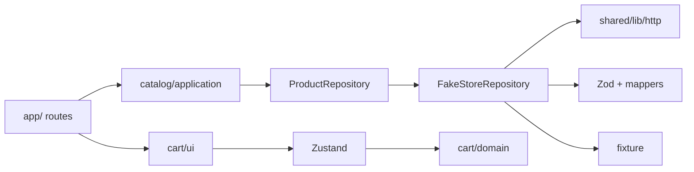
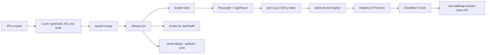

# Norte — Tienda de demostración

Aplicación de comercio electrónico desarrollada como solución al **Reto Técnico de CSTI**. Consume el catálogo público de [FakeStore API](https://fakestoreapi.com) y ofrece home, listado con filtros en la URL, fichas de producto con SEO, carrito persistente en el navegador y un pipeline de despliegue self-hosted.

| Entorno                          | URL                                                                                                                 |
| -------------------------------- | ------------------------------------------------------------------------------------------------------------------- |
| Producción                       | [csti-challenge.orlando-rojas.com](https://csti-challenge.orlando-rojas.com)                                        |
| Storybook                        | [csti-challenge-storybook.orlando-rojas.com](https://csti-challenge-storybook.orlando-rojas.com)                    |
| Catálogo de respaldo (FakeStore) | [csti-challenge-fakestore.orlando-rojas.com](https://csti-challenge-fakestore.orlando-rojas.com)                    |
| Espejo en Vercel                 | Lo publica `release.yml` con `vercel deploy --prebuilt --prod`. No es indexable y su canonical apunta a producción. |

## Stack tecnológico

| Área                | Tecnología                                                                      |
| ------------------- | ------------------------------------------------------------------------------- |
| Framework           | Next.js 16 (App Router, Cache Components), React 19, React Compiler             |
| Lenguaje            | TypeScript (`strict`, `noUncheckedIndexedAccess`, `exactOptionalPropertyTypes`) |
| Estilos y UI        | Tailwind CSS 4, Radix UI, lucide-react, `next-themes`                           |
| Estado              | Zustand (carrito), nuqs (estado en la URL)                                      |
| Validación          | Zod 4, `@t3-oss/env-nextjs`                                                     |
| Observabilidad      | Pino, OpenTelemetry (`@vercel/otel` y exportador OTLP)                          |
| Pruebas             | Vitest, Testing Library, MSW, Playwright, axe-core, Lighthouse CI               |
| Documentación de UI | Storybook 10 (`@storybook/nextjs-vite`)                                         |
| Calidad de código   | ESLint (`eslint-plugin-boundaries`), Prettier, Husky, lint-staged, commitlint   |
| Infraestructura     | Docker, GitHub Actions, GHCR, Dokploy, Cloudflare, Vercel                       |

## Arquitectura

El proyecto sigue una arquitectura modular por dominio. Cada módulo separa dominio, aplicación, infraestructura y UI, y expone una sola API pública.

```text
src/
├── app/                       Rutas, layouts, SEO y endpoints
│   ├── page.tsx               Home
│   ├── sitemap.ts  robots.ts  opengraph-image.tsx
│   ├── api/                   health, vitals, revalidate
│   ├── products/
│   │   ├── (listing)/         PLP
│   │   └── [id]/              PDP, not-found, opengraph-image
│   │       └── preview/       Vista previa como documento
│   └── @modal/(.)products/[id]/preview/   Vista rápida interceptada
├── modules/
│   ├── catalog/               domain · application · infrastructure · ui
│   └── cart/                  domain · store · ui
├── shared/                    HTTP, logger, SEO, entorno, layout común
├── instrumentation.ts         OpenTelemetry
└── proxy.ts                   404 de ids inválidos y redirect de la vista previa
```

Reglas de dependencia, verificadas por `eslint-plugin-boundaries`:

- `src/app` solo importa la API pública de cada módulo (`src/modules/*/index.ts`).
- La capa de dominio no depende de infraestructura ni de UI.
- La UI no importa infraestructura.
- Un módulo no accede a los internos de otro.



Cómo se aplica SOLID:

- **Inversión de dependencias.** La aplicación depende de la interfaz `ProductRepository`. El cliente HTTP y FakeStore quedan detrás.
- **Responsabilidad única.** El esquema, el mapper, el cliente y el repositorio están separados.
- **Abierto/cerrado.** El orden es un `Record<SortKey, Comparator>`. Una clave nueva no reescribe el filtro.

Las decisiones están en `[docs/adr](docs/adr)`:

| ADR                                                    | Tema                                       |
| ------------------------------------------------------ | ------------------------------------------ |
| [0001](docs/adr/0001-cache-components.md)              | Cache Components                           |
| [0002](docs/adr/0002-cart-state.md)                    | Estado del carrito                         |
| [0003](docs/adr/0003-url-state-nuqs.md)                | Estado en la URL con nuqs                  |
| [0004](docs/adr/0004-server-filtering-and-fallback.md) | Filtrado en servidor y fixture de respaldo |
| [0005](docs/adr/0005-testing-strategy.md)              | Estrategia de pruebas                      |
| [0006](docs/adr/0006-module-boundaries.md)             | Límites entre módulos                      |
| [0007](docs/adr/0007-self-hosted-deploy.md)            | Despliegue self-hosted                     |
| [0008](docs/adr/0008-observability.md)                 | Observabilidad                             |

## Requisitos previos

| Herramienta | Versión  | Notas                                                                     |
| ----------- | -------- | ------------------------------------------------------------------------- |
| Node.js     | ≥ 24     | Definido en `engines` de `package.json`.                                  |
| pnpm        | 10.15.1  | Se recomienda activarlo con Corepack: `corepack enable`.                  |
| Git         | Reciente | Necesario para clonar el repositorio y para los hooks de Husky.           |
| Docker      | Opcional | Solo para la imagen de producción, Storybook o el sustituto de FakeStore. |

## Ejecución en entorno local

### 1. Clonar el repositorio

```bash
git clone https://github.com/orlando-rojas/csti-challenge.git
cd csti-challenge
```

### 2. Activar pnpm e instalar dependencias

```bash
corepack enable
pnpm install
```

La instalación ejecuta `prepare`, que registra los hooks de Git de Husky (lint-staged en pre-commit y commitlint en commit-msg).

### 3. Configurar variables de entorno

```bash
cp .env.example .env.local
```

Los valores por defecto permiten ejecutar la aplicación sin cambios. Para desarrollo local se recomienda apuntar la URL canónica a localhost:

```dotenv
NEXT_PUBLIC_SITE_URL=http://localhost:3000
```

Consulta [Variables de entorno](#variables-de-entorno) para el detalle de cada una.

### 4. Sustituto de FakeStore (opcional)

`https://fakestoreapi.com` a veces no responde. El servicio en `services/fakestore` expone `GET /products`, `GET /products/categories`, `GET /products/category/:category`, `GET /products/:id` y `GET /health`. El catálogo sale de la fixture del repositorio. Las fotos quedan en el espejo público de Fake Store, así que la tienda no depende de dónde corra el servicio.

En local, en otra terminal:

```bash
pnpm fakestore
```

En `.env.local`:

```dotenv
FAKESTORE_API_URL=http://localhost:4010
```

El puerto se cambia con `PORT` o `FAKESTORE_PORT` (por defecto `4010`). Para probar la imagen en local, desde la raíz del repositorio:

```bash
docker build -f services/fakestore/Dockerfile -t fakestore .
docker run --rm -p 4010:4010 fakestore
```

En Dokploy el servicio es una aplicación Compose aparte, con `[docker-compose.fakestore.yml](docker-compose.fakestore.yml)`, en `https://csti-challenge-fakestore.orlando-rojas.com`. El compose de la tienda ya apunta `FAKESTORE_API_URL` a ese host. En local el único cambio sigue siendo esa variable. Cuando la API pública vuelva, vuelve a `https://fakestoreapi.com`.

### 5. Iniciar el servidor de desarrollo

```bash
pnpm dev
```

La aplicación queda disponible en [http://localhost:3000](http://localhost:3000).

### 6. Ejecutar el build de producción en local (opcional)

```bash
pnpm build
pnpm start
```

### 7. Ejecutar Storybook (opcional)

```bash
pnpm storybook
```

Storybook queda disponible en [http://localhost:6006](http://localhost:6006).

## Variables de entorno

Las variables de la aplicación se validan al arrancar con Zod en `[src/shared/config/env.ts](src/shared/config/env.ts)`. Si un valor no cumple el esquema, la aplicación no inicia. Las cadenas vacías se tratan como no definidas.

| Variable                      | Requerida | Valor por defecto                          | Descripción                                                                                         |
| ----------------------------- | --------- | ------------------------------------------ | --------------------------------------------------------------------------------------------------- |
| `NEXT_PUBLIC_SITE_URL`        | No        | `https://csti-challenge.orlando-rojas.com` | Origen canónico usado en metadata, sitemap y Open Graph. Se incrusta en el bundle durante el build. |
| `SITE_INDEXABLE`              | No        | `true`                                     | `false` agrega `noindex` y bloquea el rastreo. Se usa en el espejo de Vercel.                       |
| `FAKESTORE_API_URL`           | No        | `https://fakestoreapi.com`                 | URL base del catálogo. Es el único ajuste para apuntar a un servicio compatible.                    |
| `REVALIDATE_SECRET`           | No        | —                                          | Secreto (mínimo 8 caracteres) para `POST /api/revalidate`. Sin él, el endpoint responde `401`.      |
| `LOG_LEVEL`                   | No        | `info`                                     | Nivel de Pino: `fatal`, `error`, `warn`, `info`, `debug`, `trace` o `silent`.                       |
| `OTEL_EXPORTER_OTLP_ENDPOINT` | No        | —                                          | Endpoint OTLP (por ejemplo, Grafana Cloud). Sin él, no se exporta telemetría.                       |
| `OTEL_EXPORTER_OTLP_HEADERS`  | No        | —                                          | Cabeceras de autenticación del exportador OTLP.                                                     |
| `OTEL_EXPORTER_OTLP_PROTOCOL` | No        | `http/protobuf`                            | La lee el SDK de OpenTelemetry. No forma parte del esquema Zod de la aplicación.                    |
| `SKIP_ENV_VALIDATION`         | No        | —                                          | `true` omite la validación. Sirve para builds de herramientas, no para ejecutar la tienda.          |

## Scripts disponibles

| Script                 | Descripción                                                  |
| ---------------------- | ------------------------------------------------------------ |
| `pnpm dev`             | Servidor de desarrollo con recarga en caliente.              |
| `pnpm fakestore`       | Sustituto de FakeStore en el puerto 4010.                    |
| `pnpm build`           | Build de producción (salida `standalone`).                   |
| `pnpm start`           | Sirve el build de producción.                                |
| `pnpm typecheck`       | Verificación de tipos con `tsc --noEmit`.                    |
| `pnpm lint`            | ESLint, incluidas las reglas de límites entre módulos.       |
| `pnpm format`          | Formatea el código con Prettier.                             |
| `pnpm format:check`    | Comprueba el formato sin modificar archivos.                 |
| `pnpm test`            | Pruebas unitarias y de integración con cobertura.            |
| `pnpm test:watch`      | Vitest en modo observación.                                  |
| `pnpm test:contract`   | Pruebas de contrato contra FakeStore en vivo (requiere red). |
| `pnpm test:e2e`        | Pruebas end-to-end con Playwright.                           |
| `pnpm storybook`       | Storybook en el puerto 6006.                                 |
| `pnpm build-storybook` | Genera Storybook estático en `storybook-static/`.            |
| `pnpm analyze`         | Build con el analizador de bundle.                           |

## Pruebas y calidad

### Pruebas unitarias y de integración

```bash
pnpm test
```

Cubren dominio del carrito, filtro, búsqueda, orden y paginación, mappers, esquemas Zod (incluidos payloads inválidos) y componentes con Testing Library. MSW simula FakeStore, también el caso en que la API no responde y el repositorio usa la fixture. El umbral mínimo es **80 %** de líneas, funciones, ramas y sentencias en `cart/domain`, `catalog/domain` y `catalog/application`. El reporte se genera en `coverage/`.

### Pruebas de contrato

```bash
pnpm test:contract
```

Validan los esquemas Zod contra la respuesta real de FakeStore. `contract.yml` corre a diario (12:00 UTC) y al lanzarlo a mano. Si fallan y no hay un issue abierto con el mismo título, el workflow abre uno.

### Pruebas end-to-end

La primera vez, instala el navegador de Playwright:

```bash
pnpm exec playwright install --with-deps chromium
```

Luego ejecuta:

```bash
pnpm test:e2e
```

Por defecto, Playwright levanta `pnpm dev` y reutiliza un servidor ya iniciado en el puerto 3000. Para probar contra otra instancia, como el contenedor Docker, define `PLAYWRIGHT_BASE_URL`:

```bash
PLAYWRIGHT_BASE_URL=http://localhost:3000 pnpm test:e2e
```

### Verificación completa antes de abrir un PR

```bash
pnpm typecheck && pnpm lint && pnpm test && pnpm build
```

Es la misma secuencia que ejecuta el job `verify` en CI. El E2E y Lighthouse no corren en cada PR: corren en el release, contra la imagen, antes de publicarla.

## Ejecución con Docker

### Aplicación

```bash
docker build -t csti-challenge .
docker run --rm -p 3000:3000 csti-challenge
```

### Sustituto de FakeStore

```bash
docker build -f services/fakestore/Dockerfile -t csti-challenge-fakestore .
docker run --rm -p 4010:4010 csti-challenge-fakestore
```

Dokploy lo despliega con `[docker-compose.fakestore.yml](docker-compose.fakestore.yml)`. El dominio es `csti-challenge-fakestore.orlando-rojas.com` y el healthcheck usa `GET /health`.

### Storybook

Dokploy lo despliega con `[docker-compose.storybook.yml](docker-compose.storybook.yml)` en `https://csti-challenge-storybook.orlando-rojas.com`. La imagen sirve el Storybook estático con nginx.

```bash
docker build -f Dockerfile.storybook -t csti-challenge-storybook .
docker run --rm -p 6006:80 csti-challenge-storybook
```

## API interna

| Método | Ruta              | Descripción                                                                                                                               |
| ------ | ----------------- | ----------------------------------------------------------------------------------------------------------------------------------------- |
| `GET`  | `/api/health`     | Estado del servicio. Lo usan el healthcheck de Docker y el smoke test del despliegue.                                                     |
| `POST` | `/api/vitals`     | Recibe métricas Web Vitals desde el navegador (`sendBeacon`).                                                                             |
| `POST` | `/api/revalidate` | Invalida la caché del catálogo. Requiere la cabecera `x-revalidate-secret`. Acepta `{ "tag": "products" }` o `{ "tag": "product:<id>" }`. |

## Integración y despliegue continuo

Build once, deploy many. La imagen se publica en GHCR por SHA y Dokploy la descarga por webhook. Vercel es un espejo de producción, no el origen. No hay integración de Git ni previews en Vercel.



| Workflow        | Disparador                                | Responsabilidad                                                                                 |
| --------------- | ----------------------------------------- | ----------------------------------------------------------------------------------------------- |
| `ci.yml`        | PR y push a `master`                      | Job `verify`: typecheck, lint, pruebas unitarias y build.                                       |
| `release.yml`   | Push a `master`                           | Construye la imagen, ejecuta E2E y Lighthouse, publica en GHCR y despliega en Dokploy y Vercel. |
| `contract.yml`  | Diario (12:00 UTC) y manual               | Pruebas de contrato contra FakeStore; abre un issue si fallan.                                  |
| `storybook.yml` | Push a `master` con cambios de UI         | Build y publicación de Storybook.                                                               |
| `fakestore.yml` | Push a `master` con cambios del sustituto | Publica `ghcr.io/orlando-rojas/csti-challenge-fakestore` y redespliega en Dokploy.              |

Dependabot está configurado en `[.github/dependabot.yml](.github/dependabot.yml)`.

**Dokploy (proyecto** `orlando-rojas`**):** tres servicios Compose, cada uno con su `docker-compose*.yml` y labels de Traefik hacia el túnel de Cloudflare.

| Servicio  | Compose                        | Imagen                                           | Dominio                                      | Secreto GitHub                  |
| --------- | ------------------------------ | ------------------------------------------------ | -------------------------------------------- | ------------------------------- |
| Tienda    | `docker-compose.yml`           | `ghcr.io/orlando-rojas/csti-challenge`           | `csti-challenge.orlando-rojas.com`           | `DOKPLOY_WEBHOOK_URL`           |
| Storybook | `docker-compose.storybook.yml` | `ghcr.io/orlando-rojas/csti-challenge-storybook` | `csti-challenge-storybook.orlando-rojas.com` | `DOKPLOY_STORYBOOK_WEBHOOK_URL` |
| FakeStore | `docker-compose.fakestore.yml` | `ghcr.io/orlando-rojas/csti-challenge-fakestore` | `csti-challenge-fakestore.orlando-rojas.com` | `DOKPLOY_FAKESTORE_WEBHOOK_URL` |

## Decisiones técnicas y trade-offs

- **Cache Components en Next 16.** `"use cache"`, `cacheLife` y `cacheTag` en lugar de ISR clásico. El detalle y el criterio del spike están en el [ADR 0001](docs/adr/0001-cache-components.md).
- **Carrito en** `localStorage`**.** Alcanza mientras no haya checkout ni stock en el servidor. Zustand orquesta; las transiciones (agregar, cambiar cantidad, quitar, migrar) son funciones puras. `partialize` guarda `{ productId, qty, unitPrice, title, image }`, con `version` y `migrate`. El precio guardado es el del momento en que se agregó el producto, y el carrito no se comparte entre dispositivos. La alternativa con cookie, Server Actions y `useOptimistic` está en el [ADR 0002](docs/adr/0002-cart-state.md).
- **Estado de la UI en la URL.** `createSearchParamsCache` en el servidor y `useQueryState` en el cliente. Recargar, compartir y volver atrás conservan filtro, búsqueda, orden y página. Ver [ADR 0003](docs/adr/0003-url-state-nuqs.md).
- **Filtrado en el servidor.** La interfaz recibe una página ya cortada. Cuando la fuente ofrezca `limit` y `offset`, el corte se mueve al repositorio sin cambiar la URL. Ver [ADR 0004](docs/adr/0004-server-filtering-and-fallback.md).
- **Fixture de respaldo.** Si FakeStore no responde, se sirve una fixture local que no se cachea como respuesta válida. Puede desactualizarse; las pruebas de contrato diarias lo detectan.
- **Filtros de categoría como enlaces de servidor**, no como componente de cliente, para que buscadores y navegadores sin JavaScript puedan recorrerlos.
- **Vista previa en** `/preview`**.** Interceptar la ficha completa mezclaba el modal con la PDP al recargar. La ruta de preview es la del modal; un documento completo redirige a la ficha.
- **Una sola instancia.** La caché es memoria más el volumen `.next/cache`. No hay Valkey. Ver [ADR 0007](docs/adr/0007-self-hosted-deploy.md).
- **OpenTelemetry también self-hosted.** `@vercel/otel` exporta por OTLP a Grafana Cloud. Sin endpoint, los logs de Pino siguen en el contenedor. Sentry queda fuera. Ver [ADR 0008](docs/adr/0008-observability.md).
