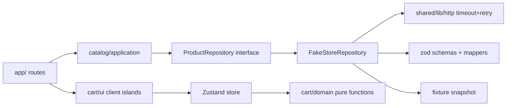
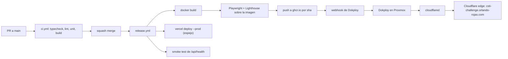

# Reto Delosi: E-commerce Frontend Senior

Una copia de este plan vive en el repo en `docs/PLAN.md`.

## 0. Decisiones cerradas (sesión de revisión del plan)

- **Alcance**: alrededor de 1 semana, haciendo lo más posible. El orden de prioridad es: requisitos obligatorios, Quick View, drawer del carrito, productos relacionados, observabilidad, View Transitions, Storybook y modo oscuro.
- **Next 16 con `cacheComponents`** (PPR + `"use cache"`). Va precedido de un spike de máximo medio día; si falla, pasamos al modelo clásico de ISR y lo registramos en un ADR.
- **Carrito**: Zustand + persist en localStorage. El carrito en el servidor (cookie + Server Actions) queda como evolución en un ADR.
- **UI**: tienda neutra con buen diseño. La interfaz va en español y el código y los commits en inglés.
- **`/`** es una home ligera: hero, categorías y productos destacados por rating.
- **Despliegue principal**: Dokploy en Proxmox, expuesto con Cloudflare Tunnel en `csti-challenge.orlando-rojas.com`. Storybook va en `csti-challenge-storybook.orlando-rojas.com` (un subdominio de un solo nivel, porque Universal SSL no cubre dos niveles).
- **Espejo en Vercel**: solo producción, desplegado desde `release.yml` con la CLI. No usamos la integración de Git ni previews.
- **Entrega**: build once, deploy many. La imagen se publica en GHCR por SHA y Dokploy la descarga por webhook.
- **Caché**: memoria y disco en una sola instancia. Valkey con `cacheHandlers` queda documentado en un ADR y solo se implementa si sobra tiempo.
- **Cloudflare** cachea solo `/_next/static/*` y `/_next/image*`. El HTML lo controla Next.
- **Observabilidad**: pino por stdout, `/api/vitals` y OTLP exportando a Grafana Cloud.
- **Calidad**: ESLint con boundaries y Prettier. Pruebas con Vitest, RTL y MSW, Playwright con axe, y pruebas de contrato programadas.
- **Git**: trunk-based con PRs cortos por feature, CI en verde y merge por squash, sin previews.

## 1. Stack tecnológico

- **Next.js 16 (App Router) + React 19 + React Compiler**, con `cacheComponents: true` y `output: "standalone"`.
- **TypeScript** con `strict`, `noUncheckedIndexedAccess` y `exactOptionalPropertyTypes`.
- **Zod**: valida las respuestas de la API en el borde, como capa anticorrupción.
- **nuqs**: estado de la URL tipado en el servidor (`createSearchParamsCache`) y en el cliente (`useQueryState`).
- **Zustand + `persist`** para el carrito.
- **Tailwind CSS v4 + shadcn/ui (Radix)** + `next-themes` para el modo oscuro.
- **Vitest + React Testing Library + MSW**, y **Playwright + @axe-core/playwright**.
- **ESLint (flat config) + eslint-plugin-boundaries + Prettier**, con **Husky + lint-staged + commitlint**.
- **@t3-oss/env-nextjs** para validar las variables de entorno.
- **pino**, **@vercel/otel** (funciona también en self-hosted) y el exportador OTLP a Grafana Cloud.
- **Storybook** (`@storybook/nextjs-vite`).
- **pnpm**, **Node 24 LTS** y **Docker**.

Al implementar, verificar con Context7 las APIs exactas de Next 16 (por ejemplo, `preload` frente a `priority` en `next/image`, `experimental.viewTransition` y `proxy.ts`).

## 2. Arquitectura: módulos por dominio con capas

```
src/
  app/
    layout.tsx  page.tsx (home)  not-found.tsx  global-error.tsx
    sitemap.ts  robots.ts
    api/ health/route.ts  vitals/route.ts  revalidate/route.ts
    products/
      layout.tsx            # renderiza {children} + {modal}
      page.tsx loading.tsx error.tsx
      [id]/ page.tsx loading.tsx error.tsx not-found.tsx opengraph-image.tsx
      @modal/ default.tsx  (.)[id]/page.tsx   # Quick View con intercepting routes
  modules/
    catalog/
      domain/          # Product, Category, Price
      application/     # getCatalog(query), getFeatured(), getRelated(): funciones puras
      infrastructure/  # fakestore.client.ts, schemas.ts, mappers.ts, product.repository.ts, fixtures/
      ui/              # ProductCard, ProductGrid, CategoryFilter, SearchInput, SortSelect, skeletons, JsonLd
      index.ts         # API pública del módulo
    cart/
      domain/  store/  ui/ (AddToCartButton, CartBadge, CartDrawer)
      index.ts
  shared/
    ui/  lib/ (http.ts, logger.ts, seo.ts, format.ts)  config/ (env.ts, site.ts)
instrumentation.ts
```

Reglas, que se hacen cumplir con `eslint-plugin-boundaries`:

- `app` importa `modules/*/index`, y los módulos importan `shared`.
- `domain` no importa nada externo.
- `ui` no importa nada de `infrastructure`.
- Un módulo no importa los archivos internos de otro.



Cómo se aplica SOLID:

- **Inversión de dependencias (DIP)**: la capa de aplicación depende de la interfaz `ProductRepository`.
- **Responsabilidad única (SRP)**: el mapper, el esquema, el cliente y el repositorio están separados.
- **Abierto/cerrado (OCP)**: las estrategias de ordenamiento son `Record<SortKey, Comparator>`.

## 3. Capa de datos y resiliencia

- `http.ts`: `AbortSignal.timeout(5s)`, reintento con backoff exponencial solo para errores 5xx y de red, y errores tipados (`ApiError`, `NotFoundError`). Cada llamada genera un span de OTel.
- Repositorio: `"use cache"` + `cacheLife('hours')` + `cacheTag('products' | 'product:{id}')`.
- `POST /api/revalidate`: protegido con un secreto, llama a `revalidateTag`. Simula el webhook de un CMS en campañas.
- **Fallback**: una fixture JSON validada con el mismo esquema. Se registra un log `warn` y un contador en OTel (`catalog.fallback.used`). Además se mantiene `error.tsx` para los fallos reales.
- **PLP**: se hace un solo fetch cacheado de `/products` y otro de `/categories`. El filtrado, la búsqueda (sin tildes) y el ordenamiento (precio ascendente y descendente, rating, nombre) se hacen en el servidor con funciones puras, porque la API no los soporta.
- **PDP**: `generateStaticParams` para los 20 productos, más fallback dinámico. Un ID inválido o inexistente llama a `notFound()`.

## 4. Estado del carrito (ADR)

- **Zustand con selectores atómicos**: solo se re-renderiza el componente suscrito. Context, en cambio, re-renderiza a todos los consumidores, y Redux es demasiado para este alcance (Zustand pesa unos 1 KB).
- **Predecible**: las transiciones son funciones puras de `cart/domain`, y el store solo las orquesta.
- **Memoria**: se guarda `{ productId, qty, unitPrice, title, image }`, con `partialize`, `version` y `migrate`.
- **Hidratación**: el badge se renderiza después de la rehidratación y usa un placeholder de tamaño fijo (CLS = 0).
- **Extras**: sincronización entre pestañas (evento `storage`), toast de feedback y anuncio del cambio por `aria-live`.
- Alternativa documentada: carrito en el servidor con cookie + Server Actions + `useOptimistic`.

## 5. Rendimiento

- Server Components por defecto. Las islas de cliente se limitan a: búsqueda, ordenamiento, filtros, botón de agregar, badge y drawer.
- `next/image`:
  - `remotePatterns` y `sizes` responsivos.
  - `preload` / `fetchPriority="high"` solo en el hero, las primeras 4 cards y la imagen de la PDP.
  - `loading="lazy"` en el resto, `aspect-ratio` fijo y formatos AVIF/WebP (con `sharp` dentro de la imagen Docker).
- `next/font`, `next/dynamic` para `CartDrawer`, y búsqueda con debounce + `useTransition` (para cuidar el INP).
- Streaming: `<Suspense>` con skeletons en el grid, las categorías y los productos relacionados.
- Presupuestos en Lighthouse CI: Performance ≥ 95, LCP < 2.5 s, CLS < 0.05, y un tope de JS (`@next/bundle-analyzer`).
- RUM: `useReportWebVitals` envía las métricas a `/api/vitals` con `sendBeacon`, que las convierte en un histograma de OTel y las manda a Grafana.

## 6. SEO

- PDP: `generateMetadata` con title, description, OpenGraph, Twitter card y canonical. Además JSON-LD con `Product` + `Offer` + `AggregateRating`, y `BreadcrumbList`.
- PLP: el canonical solo conserva `category`; las URLs con `q` llevan `noindex, follow`. JSON-LD con `ItemList`.
- `sitemap.ts` (home, categorías y productos), `robots.ts`, `opengraph-image.tsx` con `next/og`, `metadataBase` y `lang="es"`.
- **Espejo en Vercel**: `NEXT_PUBLIC_SITE_URL` apunta siempre al dominio principal (canonical) y `SITE_INDEXABLE=false` agrega `noindex`, para evitar contenido duplicado.
- Filtros como `<Link>` reales, para que los crawlers puedan seguirlos.

## 7. UX, accesibilidad y extras

- Estados: skeletons en `loading.tsx`, `error.tsx` con `reset`, Empty State con botón para limpiar filtros, `not-found` y `global-error`.
- WCAG 2.2 AA: foco visible, teclado (Radix), contraste y `prefers-reduced-motion`.
- **Quick View**: `@modal/(.)[id]` muestra el producto en un modal sobre la PLP. Al recargar o compartir el enlace se ve la PDP completa en `/products/[id]`.
- **Drawer del carrito** con cantidades, subtotal y botón de eliminar.
- **Productos relacionados** de la misma categoría, cargados por streaming.
- **View Transitions** (`experimental.viewTransition`) en la transición de la card a la PDP.
- **Modo oscuro** con `next-themes`, sin parpadeo.

## 8. Testing

- **Unitarias (Vitest)**: `cart/domain`, `catalog/application` (filtrado, búsqueda y ordenamiento), mappers y esquemas zod con payloads inválidos, y el parseo de search params con valores basura.
- **Integración (RTL + MSW)**:
  - `AddToCartButton` incrementa el `CartBadge`.
  - `SearchInput` actualiza la URL.
  - Con la API caída, el repositorio usa la fixture.
- **E2E (Playwright, sobre la imagen Docker de producción)**:
  - Al filtrar por categoría, la URL persiste al recargar.
  - Búsqueda y ordenamiento.
  - Agregar al carrito, verificar el badge y que persiste al recargar.
  - Quick View: abrir el modal, recargar y ver la PDP.
  - Un ID inexistente devuelve 404.
  - Las meta tags y el JSON-LD son correctos.
  - Análisis axe sin violaciones.
- **Contrato**: `contract.yml` (cron diario) valida los esquemas zod contra la API real y abre un issue si fallan.
- Umbral de cobertura: ≥ 80% en `domain` y `application`.

## 9. Infraestructura y despliegue



- **Dockerfile multi-stage**:
  - Etapas `deps` (`pnpm fetch`), `build` y `runner` (`node:24-alpine`, salida standalone y `sharp`).
  - Usuario sin privilegios, `HEALTHCHECK` sobre `/api/health` y la carpeta `.next/cache` en un volumen de Dokploy.
- **Dokploy**: dos apps.
  - `csti-challenge`: imagen de GHCR, variables de entorno y redeploy por webhook.
  - `csti-challenge-storybook`: Storybook estático servido con nginx, también como imagen de GHCR.
- **Cloudflare**:
  - Tunnel hacia el Traefik de Dokploy, con CNAMEs para los dos subdominios y SSL en modo Full (strict).
  - Cache Rules: `/_next/static/*` con TTL de borde de 1 año y `/_next/image*` respetando el origen. El HTML no se cachea en el borde.
  - HSTS y Brotli.
- **Vercel**: espejo solo de producción mediante `vercel deploy --prebuilt --prod` en `release.yml`, con la integración de Git desactivada.
- **Rollback**: redeploy del tag `:sha` anterior en Dokploy (documentado en el README).
- **Headers de seguridad** en `next.config.ts`: CSP, `X-Content-Type-Options`, `Referrer-Policy` y `Permissions-Policy`.
- **Workflows**: `ci.yml` (PRs), `release.yml` (`main`), `contract.yml` (cron) y `storybook.yml` (cuando cambian archivos de UI). Además Dependabot.

## 10. Observabilidad

- `instrumentation.ts` con `@vercel/otel` y el exportador OTLP a Grafana Cloud (`OTEL_EXPORTER_OTLP_ENDPOINT` y `OTEL_EXPORTER_OTLP_HEADERS`).
- Trazas: requests de Next y fetch a FakeStore (latencia, reintentos y uso del fallback).
- Métricas: LCP, INP, CLS y TTFB de usuarios reales (vía `/api/vitals`), y el contador de fallback.
- Logs JSON con pino por stdout, que se ven en Dokploy.
- Dashboard versionado en `ops/grafana/dashboard.json`, con capturas en el README.

## 11. Documentación para la sustentación

- `README.md`: URLs (principal, espejo y Storybook), scores de Lighthouse, diagramas, setup local (pnpm y Docker), scripts, decisiones y trade-offs, rollback y trabajo futuro.
- `docs/adr/`:
  1. Next 16 Cache Components
  2. Estado del carrito
  3. Estado en la URL con nuqs
  4. Procesamiento en el servidor + fallback
  5. Estrategia de testing
  6. Límites entre módulos
  7. Despliegue self-hosted, caché de una sola instancia y Cloudflare
  8. Observabilidad
- Commits con Conventional Commits y PRs cortos con descripción, para que el historial cuente la historia en el Code Review.

## 12. Cronograma (alrededor de 1 semana)

- **Día 1**: Fase 0 (scaffold, spike, Docker + Dokploy + Tunnel con un hello world, CI base). Lo antes posible, verificar que FakeStore responde desde Proxmox y desde Vercel.
- **Día 2**: módulo catalog (datos y aplicación) + home + PLP.
- **Día 3**: PDP + SEO + carrito.
- **Día 4**: pruebas (unitarias, integración, E2E y contrato) + `release.yml` completo.
- **Día 5**: Quick View, productos relacionados y observabilidad.
- **Día 6**: View Transitions, Storybook, modo oscuro, Lighthouse CI y ajuste fino de rendimiento.
- **Día 7**: README, ADRs, capturas, revisión final y ensayo de la sustentación.

## Fuera de alcance (solo si sobra tiempo)

Caché con Valkey (`cacheHandlers`), Sentry, i18n, PWA y paginación.
